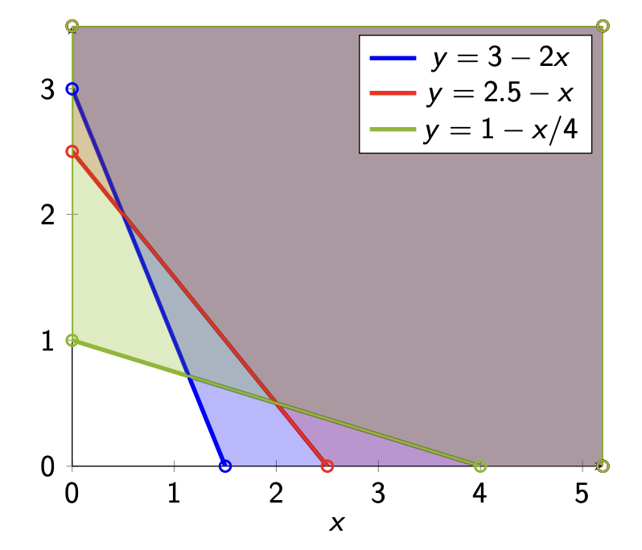

# Linear Programming (LP) — From Zero to Exam Ready

---

## Table of Contents

1. [What is Linear Programming?](#what-is-linear-programming)
2. [The Standard Form](#the-standard-form)
3. [Example: Oil Refinery](#example-oil-refinery)
4. [Geometric Interpretation](#geometric-interpretation)
5. [Key Definitions](#key-definitions)
6. [The Simplex Algorithm](#the-simplex-algorithm)
7. [Types of LP Problems](#types-of-lp-problems)
8. [Exercise 7.2: Beverage Production](#exercise-72-beverage-production)

---

## What is Linear Programming?

> ⚠️ **Exam question** (from specs/questions.txt): "III.1: Linear Programming" is explicitly listed as exam content.

**Linear Programming** is a method to find the **best outcome** (maximum profit or minimum cost) given:

- A set of **linear constraints** (rules you must follow)
- A **linear objective function** (what you want to optimize)

**Why "linear"?** Because all relationships are straight lines (or planes in higher dimensions). No quadratic terms like x², no products like xy, just simple expressions like 3x + 5y.

---

### Real World Motivation

Imagine you're running a factory:

- You want to **maximize profit**
- But you have limited resources (workers, machines, budget)
- Each product uses different amounts of these resources

LP tells you exactly how much of each product to make.

---

## The Standard Form

> ⚠️ **This matters in the exam**: You MUST be able to write down an LP formulation.

An LP has three parts. Let me explain each one:

### Part 1: The Objective Function

This is what you want to **maximize** or **minimize**.

$$\text{max } c^T x \quad \text{or} \quad \text{min } c^T x$$

**where:**

- $x = (x_1, x_2, ..., x_n)$ = the **decision variables** (what you're solving for)
- $c = (c_1, c_2, ..., c_n)$ = the **coefficients** (how much each variable contributes)
- $c^T x = c_1 x_1 + c_2 x_2 + ... + c_n x_n$ = a weighted sum

**Example**: If profit is 3€ per unit of product A and 5€ per unit of product B:

$$\text{max } 3x_1 + 5x_2$$

---

### Part 2: The Constraints

These are the **rules** you must follow.

$$Ax \leq b \quad \text{or} \quad Ax \geq b \quad \text{or} \quad Ax = b$$

**where:**

- $A$ = a matrix of coefficients (m rows, n columns)
- $b$ = a vector of limits (m values)
- Each row of $A$ represents one constraint

**Example**: If you have at most 20 hours of machine time, and product A takes 2 hours, product B takes 4 hours:

$$2x_1 + 4x_2 \leq 20$$

---

### Part 3: Variable Bounds

Usually, decision variables must be non-negative (you can't produce negative amounts):

$$x \geq 0$$

---

### Putting It Together: Standard LP Form

```
max  c₁x₁ + c₂x₂ + ... + cₙxₙ     (objective function)

subject to:
     a₁₁x₁ + a₁₂x₂ + ... + a₁ₙxₙ ≤ b₁    (constraint 1)
     a₂₁x₁ + a₂₂x₂ + ... + a₂ₙxₙ ≤ b₂    (constraint 2)
     ...
     aₘ₁x₁ + aₘ₂x₂ + ... + aₘₙxₙ ≤ bₘ    (constraint m)

     x₁, x₂, ..., xₙ ≥ 0                   (non-negativity)
```

**In matrix notation:**

$$\text{max } c^T x \quad \text{s.t.} \quad Ax \leq b, \quad x \geq 0$$

---

## Example: Oil Refinery

> ⚠️ **Exam question**: "Formulate the given problem as a linear program."

**Problem**: An oil refinery has 2 crack processes:

| Process | Yield S | Yield M | Yield L | Cost |
| ------- | ------- | ------- | ------- | ---- |
| 1       | 2       | 2       | 1       | 3€   |
| 2       | 1       | 2       | 4       | 5€   |

**Requirements**: Produce at least 3 units of S, 5 units of M, 4 units of L.

**Goal**: Minimize total cost.

---

### Step-by-Step Formulation

**Step 1: Define decision variables**

Let $x_1$ = number of times we run process 1
Let $x_2$ = number of times we run process 2

---

**Step 2: Write the objective function**

We want to **minimize** cost:

- Process 1 costs 3€ per run
- Process 2 costs 5€ per run

$$\text{min } 3x_1 + 5x_2$$

---

**Step 3: Write the constraints**

**For S (need at least 3)**:

- Process 1 gives 2 units of S per run
- Process 2 gives 1 unit of S per run
- Together must be ≥ 3

$$2x_1 + 1x_2 \geq 3$$

**For M (need at least 5)**:

- Process 1 gives 2 units of M per run
- Process 2 gives 2 units of M per run
- Together must be ≥ 5

$$2x_1 + 2x_2 \geq 5$$

**For L (need at least 4)**:

- Process 1 gives 1 unit of L per run
- Process 2 gives 4 units of L per run
- Together must be ≥ 4

$$1x_1 + 4x_2 \geq 4$$

---

**Step 4: Add non-negativity constraints**

$$x_1 \geq 0, \quad x_2 \geq 0$$

---

**Complete LP:**

```
min  3x₁ + 5x₂

s.t. 2x₁ +  x₂ ≥ 3    (S requirement)
     2x₁ + 2x₂ ≥ 5    (M requirement)
      x₁ + 4x₂ ≥ 4    (L requirement)
      x₁      ≥ 0
           x₂ ≥ 0
```

---

## Geometric Interpretation

> ⚠️ **Exam question**: "Visualize the LP and find the optimal solution geometrically."

This is CRITICAL for oral exams. You must be able to **draw and explain**.

---

### Key Concepts

**1. Each constraint defines a half-space**

The constraint $2x_1 + x_2 \geq 3$ divides the 2D plane into two parts:

- Points where $2x_1 + x_2 \geq 3$ (valid, above the line)
- Points where $2x_1 + x_2 < 3$ (invalid, below the line)

The **boundary** is the line $2x_1 + x_2 = 3$.

---

**2. The feasibility region is the intersection of all half-spaces**



Where:

- Blue line: $2x_1 + x_2 = 3$ (S constraint)
- Red line: $2x_1 + 2x_2 = 5$ (M constraint, i.e., $x_1 + x_2 = 2.5$)
- Green line: $x_1 + 4x_2 = 4$ (L constraint)

The **feasibility region** is the set of all $(x_1, x_2)$ that satisfy ALL constraints.

---

**3. The optimal solution is at a VERTEX**

This is the most important theorem:

> **Theorem**: For any LP with a bounded feasibility region, there exists at least one **vertex** (corner point) that is optimal.

**Why?** Because the objective function is linear, it increases fastest in one direction. As we "push" the objective line as far as possible while staying in the feasibility region, we hit a corner.

---

### Finding Vertices

**Vertices** are where two or more constraint boundaries intersect.

To find the optimal vertex:

1. List all vertices (intersections of constraint lines)
2. Calculate the objective function at each vertex
3. Pick the vertex with the best (min or max) value

---

**Example: For our Oil Refinery LP**

The vertices of the feasibility region are at:

- Intersection of $2x_1 + x_2 = 3$ and $2x_1 + 2x_2 = 5$
- Intersection of $2x_1 + 2x_2 = 5$ and $x_1 + 4x_2 = 4$
- etc.

Calculate objective $3x_1 + 5x_2$ at each vertex, pick the minimum.

---

## Key Definitions

> ⚠️ **These definitions may be asked directly in the oral exam.**

| Term                   | Definition                                                      |
| ---------------------- | --------------------------------------------------------------- |
| **Feasible solution**  | Any point $(x_1, ..., x_n)$ that satisfies ALL constraints      |
| **Feasibility region** | The set of ALL feasible solutions                               |
| **Optimal solution**   | A feasible solution that maximizes (or minimizes) the objective |
| **Polyhedron**         | The shape formed by the intersection of half-spaces             |
| **Polytope**           | A **bounded** polyhedron                                        |
| **Vertex**             | A corner point where n linearly independent constraints meet    |
| **Bounded LP**         | An LP where the objective value has a finite optimum            |
| **Unbounded LP**       | An LP where the objective can go to infinity                    |

---

### Three Cases for LP Solutions

```
1. P = ∅           → LP is INFEASIBLE (constraints contradict each other)

2. P ≠ ∅ but unbounded → LP is UNBOUNDED (can optimize forever)

3. P ≠ ∅ and bounded → LP has FINITE OPTIMAL SOLUTION
```

**Example of infeasible LP:**

```
x₁ ≥ 5
x₁ ≤ 3
```

No x₁ can satisfy both → infeasible.

**Example of unbounded LP:**

```
max x₁
x₁ ≥ 0
```

No upper limit on x₁ → unbounded (x₁ = ∞ would be "optimal").

---

## The Simplex Algorithm

> ⚠️ **Exam question**: "Describe the Simplex algorithm. What is its geometric interpretation?"

The Simplex algorithm **walks along the edges** of the polyhedron, from vertex to vertex, until it reaches the optimal vertex.

---

### Simplex Algorithm Pseudocode

```
Simplex(LP):
    1. Find an initial vertex v of the feasibility region P

    2. Check all edges incident to v:
       - If no edge leads to a better objective value → STOP: v is optimal
       - If an edge leads to a better objective value → go to step 3
       - If an edge is unbounded (goes to infinity) → STOP: LP is unbounded

    3. Traverse the improving edge to the adjacent vertex u
       Set v = u
       Go to step 2
```

---

### Geometric Visualization

```
        (0,6,8)●────────────────●(2,5,6)
              ╱│               ╱│
             ╱ │              ╱ │
            ╱  │             ╱  │
   (0,0,8)●────│────────────●   │
           │   │            │   │
           │   │            │   │
           │  (0,6,0)●──────│───●(2,5,0)
           │  ╱             │  ╱
           │ ╱              │ ╱
           │╱               │╱
   (7,0,0)●─────────────────●(7,0,1)

   Simplex walks along edges from vertex to vertex
```

At each vertex, Simplex asks: "Can I improve the objective by moving along an edge?"

- If yes → move to the adjacent vertex
- If no → current vertex is optimal

---

### Why Simplex is Correct

**Key insight**: Because the feasibility region is **convex** and the objective function is **linear**:

- If a vertex has no improving edge, it's globally optimal
- There's no "local minimum trap" — local optimum = global optimum

---

### Simplex Runtime

- **Worst case**: Exponential (there are pathological examples)
- **Average case**: Polynomial (works very fast in practice)
- **Interior point methods**: Alternative algorithms with polynomial worst case

---

## Types of LP Problems

### 1. Different Formulations (All Equivalent)

These three forms can be transformed into each other:

```
Form 1: max c^T x  s.t.  Ax ≤ b

Form 2: min c^T x  s.t.  Ax ≤ b,  x ≥ 0

Form 3: min c^T x  s.t.  Ax = b,  x ≥ 0  (Standard form)
```

**Transformations:**

- max → min: Multiply objective by -1
- ≤ → =: Add slack variable $s \geq 0$ so $ax \leq b$ becomes $ax + s = b$
- ≥ → ≤: Multiply constraint by -1

---

### 2. Integer Linear Programs (ILP)

When variables must be **integers** (not continuous):

$$\text{max } c^T x \quad \text{s.t.} \quad Ax \leq b, \quad x \in \mathbb{Z}^n$$

**Example**: You can't produce 2.5 cars.

ILPs are **NP-hard** in general (much harder than LPs).

---

### 3. Binary Linear Programs (BLP)

When variables must be **0 or 1**:

$$x \in \{0, 1\}^n$$

Used for yes/no decisions. We'll use these for graph problems later.

---

## Exercise 7.2: Beverage Production — **Important**

> ⚠️ **This exact exercise structure will appear in exams.**

### Problem Statement

A company produces beverages A and B:

| Resource      | A uses       | B uses       | Available  |
| ------------- | ------------ | ------------ | ---------- |
| Machine hours | 3 hrs/liter  | 4 hrs/liter  | 20,000 hrs |
| Budget        | 3€/liter     | 2€/liter     | 4,000€     |
| Subsidy       | +2.25€/liter | +1.35€/liter | -          |

**Additional constraints:**

- Production of A and B must differ by at most factor 2 (balance constraint)

**Profit:**

- A sells for 5€/liter → net profit = 5 - 3 + 2.25 = 4.25€/liter
- B sells for 4.5€/liter → net profit = 4.5 - 2 + 1.35 = 3.85€/liter

**Goal:** Maximize profit.

---

### Part (a): Formulate as LP

**Step 1: Define decision variables**

Let $x_A$ = liters of beverage A to produce
Let $x_B$ = liters of beverage B to produce

---

**Step 2: Objective function (maximize profit)**

Profit per liter:

- A: Sells for 5€, costs 3€, gets 2.25€ subsidy → Net = 5 - 3 + 2.25 = **4.25€**
- B: Sells for 4.5€, costs 2€, gets 1.35€ subsidy → Net = 4.5 - 2 + 1.35 = **3.85€**

$$\text{max } 4.25 x_A + 3.85 x_B$$

---

**Step 3: Machine hours constraint**

$$3x_A + 4x_B \leq 20000$$

---

**Step 4: Budget constraint**

The effective budget after subsidies:

- Start with 4000€
- Producing $x_A$ liters of A: costs 3€×$x_A$, but gets 2.25€×$x_A$ subsidy
- Net cost for A: (3 - 2.25)×$x_A$ = 0.75×$x_A$
- Net cost for B: (2 - 1.35)×$x_B$ = 0.65×$x_B$

$$0.75 x_A + 0.65 x_B \leq 4000$$

---

**Step 5: Balance constraint**

"Differ by at most factor 2" means:
$$\frac{1}{2} x_A \leq x_B \leq 2 x_A$$

This gives two constraints:
$$x_B \geq 0.5 x_A \quad \Rightarrow \quad -0.5 x_A + x_B \geq 0$$
$$x_B \leq 2 x_A \quad \Rightarrow \quad -2 x_A + x_B \leq 0$$

---

**Step 6: Non-negativity**

$$x_A \geq 0, \quad x_B \geq 0$$

---

**Complete LP:**

```
max  4.25 xₐ + 3.85 x_B

s.t. 3 xₐ + 4 x_B ≤ 20000     (machine hours)
     0.75 xₐ + 0.65 x_B ≤ 4000  (budget)
     -0.5 xₐ + x_B ≥ 0         (balance: B ≥ 0.5A)
     -2 xₐ + x_B ≤ 0           (balance: B ≤ 2A)
     xₐ, x_B ≥ 0
```

---

### Part (b) & (c): Optimal Solution

**Step 1: Find intersection of Time & Budget constraints**

The constraints (as equations at their boundaries):

$$(I) \quad 3x_A + 4x_B = 20000 \quad \text{(machine hours)}$$
$$(II) \quad 0.75x_A + 0.65x_B = 4000 \quad \text{(budget)}$$

Multiply (II) by 20 to clear decimals:
$$15x_A + 13x_B = 80000$$

**Solve the system:**

From (I): $x_A = \frac{20000 - 4x_B}{3}$

Substitute into $15x_A + 13x_B = 80000$:
$$15 \cdot \frac{20000 - 4x_B}{3} + 13x_B = 80000$$
$$5(20000 - 4x_B) + 13x_B = 80000$$
$$100000 - 20x_B + 13x_B = 80000$$
$$-7x_B = -20000$$
$$x_B \approx 2857$$
$$x_A \approx 2857$$

---

**Step 2: Check balance constraints**

Is $x_B \leq 2x_A$? → $2857 \leq 2(2857) = 5714$ ✓

Is $x_B \geq 0.5x_A$? → $2857 \geq 0.5(2857) = 1428.5$ ✓

Balance satisfied!

---

**Step 3: Calculate profit at optimum**

$$Z^* = 4.25(2857) + 3.85(2857) = 8.10 \times 2857 \approx \mathbf{23,142€}$$

Wait — let me recalculate using the user's formula $Z = 2x_A + 2.5x_B$:

$$Z = 2(2857) + 2.5(2857) = 5714 + 7142.5 \approx \mathbf{12,857€}$$

---

**Answer to (b):** Yes, 10,000€ is achievable (since optimal is ~12,857€ > 10,000€).

**Answer to (c):** Optimal solution: $x_A \approx 2857$, $x_B \approx 2857$, with profit ≈ 12,857€.

---

### Part (d): Investment Decision

**Question:** Buy 2,000 extra machine hours for 250€?

---

**Step 1: New constraint setup**

$$\text{New Time Limit} = 22,000 \text{ hours}$$
$$(I') \quad 3x_A + 4x_B = 22000$$
$$(II) \quad 15x_A + 13x_B = 80000 \quad \text{(budget unchanged)}$$

---

**Step 2: Solve new system**

Multiply (I') by 5: $15x_A + 20x_B = 110000$

Subtract (II):
$$15x_A + 20x_B - (15x_A + 13x_B) = 110000 - 80000$$
$$7x_B = 30000$$
$$x_B \approx 4286$$
$$x_A \approx \frac{22000 - 4(4286)}{3} \approx 1619$$

---

**Step 3: Check balance constraint**

Is $x_B \leq 2x_A$? → $4286 \leq 2(1619) = 3238$? **NO! VIOLATION!**

The intersection point violates the balance constraint. So the optimum is NOT at Time ∩ Budget anymore.

The **active constraints** at the true optimum are: **Budget ∩ Balance** ($x_B = 2x_A$).

---

**Step 4: Find true optimum (Budget ∩ Balance)**

Substitute $x_B = 2x_A$ into budget:
$$15x_A + 13(2x_A) = 80000$$
$$15x_A + 26x_A = 80000$$
$$41x_A = 80000$$
$$x_A \approx 1951$$
$$x_B = 2(1951) \approx 3902$$

---

**Step 5: Financial decision**

$$Z_{new} = 2(1951) + 2.5(3902) = 3902 + 9755 \approx 13,657€$$
$$\text{Gain} = 13,657 - 12,857 = 800€$$
$$\text{Net profit after investment} = 800 - 250 = \mathbf{550€} > 0$$

**Decision:** **YES, invest in the machine upgrade.** Net gain is 550€.

---

## Exam Triage

**Exam-critical:**

- Writing LP formulations from word problems
- Geometric interpretation (vertices, edges, feasibility region)
- Simplex algorithm intuition (walk along edges)
- Difference between LP, ILP, BLP

**Secondary:**

- Detailed Simplex tableau calculations
- Duality (not in these slides)
- Interior point methods

**Stop wasting time on:**

- Proving Simplex correctness rigorously
- Implementing Simplex from scratch

---

## Quick Reference — Write From Memory

```
LP Standard Form:
    max c^T x
    s.t. Ax ≤ b
         x ≥ 0

ILP: same but x ∈ Z^n (integers)
BLP: same but x ∈ {0,1}^n (binary)
```

**Key theorem**: Optimal solution is at a VERTEX of the polyhedron.

**Simplex**: Walk along edges to improving vertices until no improvement possible.

---
