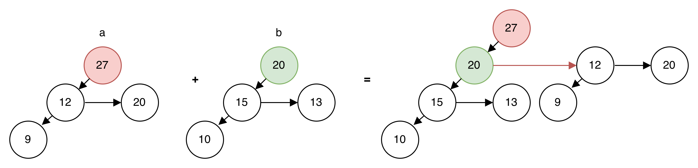
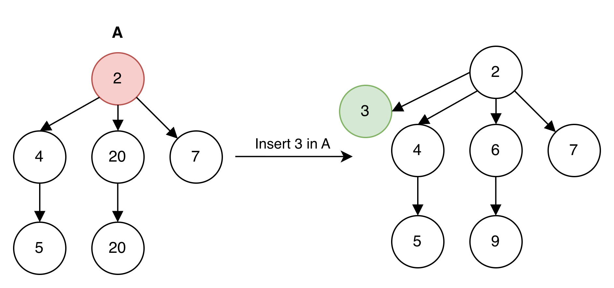

# Centrality Indices and Betweenness Centrality

## Table of Contents

1. [Shortest Path Foundations](#shortest-path-foundations)
2. [Graph Data Structures](#graph-data-structures)
3. [⚠️ Amortized Analysis Refresher — EXAM CRITICAL](#️-amortized-analysis-refresher--exam-critical)
4. [⚠️ Heaps — Why This Matters for Dijkstra](#️-heaps--why-this-matters-for-dijkstra)
5. [Centrality Indices](#centrality-indices)
6. [⚠️ Betweenness Centrality — EXAM CRITICAL](#️-betweenness-centrality--exam-critical)
7. [The Basic Betweenness Algorithm](#the-basic-betweenness-algorithm)
8. [⚠️ Brandes' Algorithm — FULL DEPTH REQUIRED](#️-brandes-algorithm--full-depth-required)
9. [Brandes By Hand: One Table Method](#brandes-by-hand-one-table-method)
10. [Worked Example: Full Brandes Trace](#worked-example-full-brandes-trace)
11. [Exam Triage](#exam-triage)
12. [Exercise 3.3: Extending Brandes](#exercise-33-extending-brandes)
13. [Exercise 3.4: Centrality on Concrete Graphs](#exercise-34-centrality-on-concrete-graphs)
14. [Exercise 3.1: DAG Shortest Paths](#exercise-31-dag-shortest-paths)
15. [Exercise 3.2: Edge-Vertex Centrality Relations](#exercise-32-edge-vertex-centrality-relations)
16. [Pairing Heaps](#pairing-heaps)
17. [Exercise 4.2: Betweenness Algorithms for Trees](#exercise-42-betweenness-algorithms-for-trees)
18. [Tree Center](#tree-center)

---

## Shortest Path Foundations

You cannot explain betweenness without understanding shortest paths. The examiner assumes you know this cold.

### Walk vs Path

Draw this on your whiteboard:

```
    s ──1── b ──2── c
            │
            4
            │
            e ──2── f ──3── t
```

A **walk** is a sequence (v₀, e₁, v₁, ..., eₖ, vₖ). Vertices CAN repeat.  
A **path** is a walk where all vertices are **distinct**.

An examiner might ask: "Can a walk contain cycles?"

**Answer**: Yes. The walk (s, b, e, b, c) is valid—b appears twice. But this is NOT a path.

If they interrupt you here: Immediately draw a walk with a repeated vertex. Show you understand the difference mechanically.

---

### Dijkstra's Algorithm

**Why it exists**: We need shortest (s, v)-paths for all v from a source s. This is the SSSP problem.

**Draw and trace**:

```
Initial:
    s ──2── b ──1── d
    │       │
    4       2
    │       │
    c ──1── e ──3── t

    dist = {s:0, b:∞, c:∞, d:∞, e:∞, t:∞}
    Q = {s:0, b:∞, c:∞, d:∞, e:∞, t:∞}
```

**ExtractMin → s (dist=0):**

```
    Relax (s,b): dist[b] = min(∞, 0+2) = 2
    Relax (s,c): dist[c] = min(∞, 0+4) = 4

    dist = {s:0, b:2, c:4, d:∞, e:∞, t:∞}
```

**ExtractMin → b (dist=2):**

```
    Relax (b,d): dist[d] = min(∞, 2+1) = 3
    Relax (b,e): dist[e] = min(∞, 2+2) = 4

    dist = {s:0, b:2, c:4, d:3, e:4, t:∞}
```

Continue until Q is empty.

**Pseudocode** (you must be able to write this):

```
Dijkstra(s):
    dist[s] = 0; InsertQ(s, 0)
    for all v ≠ s: dist[v] = ∞; InsertQ(v, ∞)

    while Q ≠ ∅:
        v = ExtractMinQ()
        for each edge (v, w):
            if dist[w] > dist[v] + c(v,w):
                dist[w] = dist[v] + c(v,w)
                DecreasePrioQ(w, dist[w])
    return dist
```

**Runtime**—this matters when they ask about Fibonacci Heaps:

| Queue Type     | InsertQ  | ExtractMinQ     | DecreasePrioQ | Total          |
| -------------- | -------- | --------------- | ------------- | -------------- |
| Binary Heap    | O(log n) | O(log n)        | O(log n)      | O((n+m) log n) |
| Fibonacci Heap | O(1)     | O(log n) amort. | O(1) amort.   | O(m + n log n) |

If the examiner asks: "Why is Fibonacci Heap faster?"

**Answer mechanically**: We perform m DecreasePrioQ operations. With binary heap, each costs O(log n). With Fibonacci heap, each costs O(1) amortized. So we save a factor of log n on the m term.

---

**STOP. Explain back to me**: Why does DecreasePrioQ being O(1) matter? What's the total runtime improvement?

**Answer**: Dijkstra calls DecreasePrioQ at most once per edge, so m times total. With binary heap, each call is O(log n), giving O(m log n) for all decrease operations. With Fibonacci heap, each call is O(1) amortized, giving O(m) total. Combined with n ExtractMin operations at O(log n) each, the total drops from O((n+m) log n) to O(m + n log n). On dense graphs where m ≈ n², this is a significant improvement—from O(n² log n) to O(n²).

---

## Graph Data Structures

Choosing the right structure depends on whether the graph is **sparse** or **dense**.

| Data Structure   | Space  | Iterate Neighbors | Verify Edge (v,w)     |
| ---------------- | ------ | ----------------- | --------------------- |
| Adjacency Matrix | O(V²)  | O(V)              | O(1)                  |
| Adjacency List   | O(V+E) | O(deg(v))         | O(deg(v))             |
| Adjacency Set    | O(V+E) | O(deg(v))         | O(log deg(v)) or O(1) |

### When to Use Which?

**Dense graphs (m ≈ V²)**: Use **Adjacency Matrix**

- Almost every pair has an edge → big V×V grid is acceptable
- O(1) edge lookup is the advantage

**Sparse graphs (m ≪ V²)**: Use **Adjacency List**

- Don't waste memory on edges that don't exist
- O(deg) neighbor iteration is fine when degree is small

### Example: Dense Graph

```
Edges: A-B, A-C, A-D, B-D, C-D

Adjacency Matrix:           Adjacency List:
    A  B  C  D              A → [B, C, D]
A   0  1  1  1              B → [A, D]
B   1  0  0  1              C → [A, D]
C   1  0  0  1              D → [A, B, C]
D   1  1  1  0
```

**Winner for dense**: Matrix — minimal wasted space, O(1) edge lookups.

### Example: Sparse Graph (6 nodes, 4 edges)

```
Edges: A-B, A-C, E-F

Matrix (mostly zeros):      List (compact):
    A  B  C  D  E  F        A → [B, C]
A   0  1  1  0  0  0        B → [A]
B   1  0  0  0  0  0        C → [A]
C   1  0  0  0  0  0        D → []
D   0  0  0  0  0  0        E → [F]
E   0  0  0  0  0  1        F → [E]
F   0  0  0  0  1  0
```

**Winner for sparse**: List — no wasted space, O(degree) neighbor iteration.

---

## ⚠️ Amortized Analysis Refresher — EXAM CRITICAL

⚠️ Exam question: "Explain the amortized analysis of Fibonacci Heaps."

You cannot explain Fibonacci heap runtimes without understanding amortized analysis.

### Intuition: The Spike and The Interval

Amortized analysis guarantees the average performance of each operation in a **worst-case sequence**.

- **The Spike (Actual Cost cᵢ)**: Standard worst-case analysis assumes every operation hits the maximum possible cost
- **The Interval**: Amortized analysis spreads that rare "spike" over the entire sequence

**Note**: This differs from _Average Case Analysis_, which relies on probabilistic inputs. Amortized analysis is a **hard guarantee** for any valid sequence.

### Formal Definition

Let c₁, c₂, ..., cₙ be the actual costs of a sequence of n operations.
Let ĉ₁, ĉ₂, ..., ĉₙ be the amortized costs assigned to these operations.

For the amortized analysis to be valid:
$$\sum_{i=1}^{n} c_i \leq \sum_{i=1}^{n} \hat{c}_i$$

**Translation**: The total "credit" claimed must cover the total "bill" paid.

### The Potential Method

We define a potential function Φ(D) that maps the state of the data structure to a real number.

**Amortized cost formula**:
$$\hat{c}_i = c_i + \Phi(D_i) - \Phi(D_{i-1})$$

By summing, we observe a **telescoping sum**:
$$\sum_{i=1}^{n} \hat{c}_i = \sum_{i=1}^{n} c_i + \Phi(D_n) - \Phi(D_0)$$

**Constraint**: To ensure Σcᵢ ≤ Σĉᵢ, we require Φ(Dₙ) ≥ Φ(D₀).

---

### The "Tripling" Data Structure — Mock Exam Practice

**The Problem**: A data structure has the following costs for operation k:

- **Rule A**: If k is an exact power of 3 (1, 3, 9, 27, 81...), the cost is k
- **Rule B**: Otherwise, the cost is 1

**Task**: Prove the amortized cost is O(1).

**Intuitive calculation for the interval ending at k=27**:

1. Previous spike was at k=9
2. Cheap operations in interval: 27 - 9 - 1 = 17
3. To cover spike of 27 in 17 steps: 27/17 ≈ 1.58 → round up to **2**
4. Amortized cost = 1 (actual work) + 2 (savings) = **3**

#### The Accounting Method

Assign a fixed charge of **3 credits** to every operation.

**Case A: Cheap Operation (k ≠ 3ʲ)**

- Amortized Charge: 3 credits
- Actual Cost: 1 credit
- Action: Pay 1, bank **2 credits**

**Case B: Spike Operation (k = 3ʲ)**

- Bill: 3ʲ
- Saved since last spike: ~2 × (2·3ʲ⁻¹) = 4·3ʲ⁻¹
- Since 4·3ʲ⁻¹ > 3ʲ, we can pay the bill ✓

#### The Potential Method

Define: Φ(Dₖ) = 2·(k - 3^⌊log₃ k⌋)

**Case A**: Cheap operation (k not a power of 3)

- ΔΦ = 2
- Amortized cost = 1 + 2 = **3** ✓

**Case B**: Spike operation (k = 3ʲ)

- Φ(k) = 0 (new spike, distance = 0)
- Φ(k-1) ≈ 4k/3
- Amortized cost = k + 0 - 4k/3 = -k/3 ≤ 3 ✓

---

## ⚠️ Heaps — Why This Matters for Dijkstra

⚠️ Exam question: "What are the runtimes of Fibonacci Heaps? How does the amortized analysis work?"

Dijkstra's algorithm repeatedly:

1. **Extract-min** — get the next closest vertex
2. **Decrease-key** — relax edges and update distances

With n vertices and m edges:

- n extract-min operations
- Up to m decrease-key operations

| Priority Queue | Extract-Min     | Decrease-Key    | Dijkstra Total     |
| -------------- | --------------- | --------------- | ------------------ |
| Binary Heap    | O(log n)        | O(log n)        | O((n+m) log n)     |
| Fibonacci Heap | O(log n) amort. | **O(1) amort.** | **O(n log n + m)** |

---

### Binary Heap

A binary heap satisfies two properties:

**1. Structure Property (Complete Binary Tree)**

```
       Valid:              Invalid:
         10                   10
        /  \                 /  \
       20   30              20   30
      /  \  /              /    /  \
     40  50 60            40   50   60
                               ^
                          gap not allowed
```

**2. Heap Property (Ordering)**

- **Min-Heap**: Every parent ≤ its children. Root is minimum.
- **Max-Heap**: Every parent ≥ its children. Root is maximum.

**Critical insight**: The heap property only enforces **parent-child** relationships, NOT sibling relationships.

#### Array Representation

```
Tree:           Array (1-indexed):
       5        [_, 5, 10, 15, 20, 25]
      / \           1   2   3   4   5
     10  15
    /  \
   20   25
```

**Index Formulas (1-indexed)**:

- Parent of i: ⌊i/2⌋
- Left child of i: 2i
- Right child of i: 2i + 1

#### Operations

**Insert(key)** — O(log n)

1. Place new key at end (maintains completeness)
2. **Bubble up**: Compare with parent, swap if smaller, repeat

**Extract-Min** — O(log n)

1. Save root (the minimum)
2. Move last element to root
3. **Bubble down**: Swap with smaller child, repeat

**Decrease-Key(i, new_key)** — O(log n)

1. Update key at position i
2. Bubble up (element might be smaller than parent now)

**The problem**: To call decrease-key, you need the **index i** of the element. In Dijkstra, this requires an auxiliary **position map**: pos[v] = index in heap.

**Build-Heap(array)** — O(n), NOT O(n log n)!

**Why O(n)?** — Common exam question:

- Nodes at height h do at most h swaps during bubble-down
- There are ⌈n/2^(h+1)⌉ nodes at height h
- Total: Σ (n/2^(h+1))·O(h) = O(n)·Σ(h/2^(h+1)) = O(n)

The sum Σ h/2^(h+1) converges to a constant (equals 1).

#### Binary Heap Runtime Summary

| Operation    | Runtime  | Notes                          |
| ------------ | -------- | ------------------------------ |
| Insert       | O(log n) | Bubble up                      |
| Extract-Min  | O(log n) | Bubble down                    |
| Find-Min     | O(1)     | Just look at root              |
| Decrease-Key | O(log n) | Bubble up (need position map!) |
| Build-Heap   | O(n)     | Bottom-up heapify              |
| Merge        | O(n)     | Must rebuild entirely          |

---

### ⚠️ Fibonacci Heap — FULL DEPTH REQUIRED

⚠️ Exam question: "How do Fibonacci heaps achieve O(1) decrease-key? Explain the mark bit and cascading cuts."

A Fibonacci heap is a collection of heap-ordered trees with relaxed structure:

- Trees of **any shape** are allowed
- Multiple trees connected via **doubly linked root list**
- Each node stores: parent, degree, left/right siblings, **mark bit**

```
Root list (doubly linked):
  [Tree1] ←→ [Tree2] ←→ [Tree3] ←→ ...
     ↑                              |
     └──────────────────────────────┘

Min pointer → smallest root
```

#### Why Do We Mark Nodes?

**Exam question**: "Why do we bother with marks in Fibonacci heaps?"

**Answer**: We need to bound the maximum degree of any node. This bound is crucial for proving the runtime of Extract-Min.

- If we **never cut** parents: trees become wide and flat → node can have too many children → Extract-Min becomes expensive
- If we **always cut** immediately: trees become tall and thin (like linked lists) → degree bound breaks

The marking rule strikes a balance: it ensures a node of degree k has at least ~F\_{k+2} descendants (Fibonacci numbers), so maximum degree is O(log n).

#### Operations

**Insert** — O(1) amortized

- Create a single-node tree
- Add to root list
- Update min pointer if needed

**Why stay lazy?** We don't consolidate during Insert because that would destroy the O(1) cost. We delay consolidation until Extract-Min.

**Extract-Min** — O(log n) amortized

1. Remove the minimum root
2. Add all its children to the root list
3. **Consolidate**: link trees of equal degree until no two roots have the same degree

**Actual vs Amortized cost**:

- **Worst-case actual**: O(n) if all nodes are in root list
- **Amortized**: O(D(n)) where D(n) = max degree = O(log n)

**Decrease-Key** — O(1) amortized

1. Decrease the key value
2. If heap property violated (new value < parent), **cut** the node
3. Move cut node to root list
4. If parent was marked, trigger **cascading cut**

**Cascading Cut**: If a marked node loses another child, it's also cut and moved to root list. Repeat upward.

#### The Mark Bit — Precise Definition

A node x becomes **marked** if it has lost **exactly one** child since the last time it was made a child of another node.

- Newly created nodes: **unmarked**
- Node loses first child: becomes **marked**
- Marked node loses second child: **cut immediately** (cascading cut)
- Node moved to root list: becomes **unmarked**

#### The Potential Function

$$\Phi(H) = t(H) + 2m(H)$$

where:

- t(H) = number of trees in root list
- m(H) = number of marked nodes

**Why the coefficient 2?** — Classic exam question

When a cascading cut happens:

- Marked node is cut → moves to root list
- t(H) increases by 1 (bad)
- Node becomes unmarked → m(H) decreases by 1

If formula was t + m: change = +1 - 1 = 0 (no savings!)
With t + 2m: change = +1 - 2 = **-1** (releases 1 credit to pay for the cut)

#### Amortized Analysis of Extract-Min

**Key insight**: Consolidation links trees of equal degree, reducing t(H).

Each link operation:

- Reduces t(H) by 1 (two trees become one)
- Potential drops by 1
- This "pays" for the link

**Result**: Amortized cost of Extract-Min = O(D(n)) = O(log n)

#### Fibonacci Heap Runtime Summary

| Operation    | Actual (worst) | Amortized    |
| ------------ | -------------- | ------------ |
| Insert       | O(1)           | O(1)         |
| Find-Min     | O(1)           | O(1)         |
| Extract-Min  | O(n)           | **O(log n)** |
| Decrease-Key | O(n)           | **O(1)**     |
| Merge        | O(1)           | O(1)         |
| Delete       | O(n)           | O(log n)     |

---

### Quiz Time (Active Recall)

**1. Conceptual**: Why don't we merge trees during Insert?
_Answer_: That would make Insert O(log n). We want Insert O(1) so we can handle massive data quickly. We procrastinate until Extract-Min.

**2. Runtime**: What is the **worst-case** cost of one Extract-Min?
_Answer_: O(n). If we did n inserts, we have n roots. Must look at all of them. But **amortized** is O(log n) because we paid for this work using savings from cheap inserts.

**3. The Mark**: If a node is marked, what does it tell you about its history?
_Answer_: It has already lost one child while under its current parent. If it loses another, it will be cut immediately (Cascading Cut).

---

## Centrality Indices

### Closeness Centrality (Secondary—do not go deep)

$$c_C(v) = \frac{1}{\sum_{w \neq v} d(v, w)}$$

**Intuition in one sentence**: A vertex is central if its average distance to everyone is small.

**The fatal flaw**: If v cannot reach w, then d(v,w) = ∞, so c_C(v) = 0 even if v can reach many other nodes.

We are not spending more time on this. It appears in slides but not as a primary exam question.

---

### Harmonic Closeness Centrality (Secondary—do not go deep)

$$c_H(v) = \sum_{w \neq v} \frac{1}{d(v, w)}$$

**Why it exists**: Fixes the disconnected graph problem. Since 1/∞ = 0, unreachable vertices contribute nothing instead of killing the whole sum.

We are moving on. This is not exam-critical.

---

## ⚠️ Betweenness Centrality — EXAM CRITICAL

This appears in exam questions directly:

- "Which centrality measures did we discuss and what are their intuitions?"
- "Which naive algorithms exist for betweenness?"
- "How does Brandes' Algorithm work (write pseudocode)?"
- "Prove correctness of Brandes' Algorithm."
- "Analyze runtime of Brandes' Algorithm."

You must be able to answer ALL of these under pressure.

---

### Why Betweenness Exists

Social networks: People who lie on many shortest paths control information flow. If they leave the company, communication breaks down.

Draw this:

```
    Cluster A          Cluster B
       ○──○              ○──○
        \ │              │ /
         \│              │/
          v ─────────── w
         /│              │\
        / │              │ \
       ○──○              ○──○
```

Vertex v bridges two clusters. Remove v → Cluster A is isolated. That's why v has HIGH betweenness.

---

### The Definition

$$c_B(v) = \sum_{s,t \in V} \frac{\sigma_{st}(v)}{\sigma_{st}}$$

Where:

- σ_st = number of shortest paths from s to t
- σ_st(v) = number of those paths that pass through v (not counting when v is an endpoint)

**Conventions**—these matter when you compute by hand:

- σ_ss = 1 for all s
- If v ∈ {s, t}, then σ_st(v) = 0
- 0/0 = 0 by convention
- In undirected graphs, count (s,t) and (t,s) as ONE path (pairwise)

---

### Computing σ_st(v): The Bellman Criterion

This step matters in the exam—if you cannot explain this, the entire Brandes proof falls apart.

**Theorem**: v lies on SOME shortest s-t path **if and only if**:
$$d(s,t) = d(s,v) + d(v,t)$$

**Why?** If the shortest s-t distance equals the distance through v, then going through v is optimal. If it's less, some other path is shorter and doesn't use v.

**When v is on a shortest path**:
$$\sigma_{st}(v) = \sigma_{sv} \cdot \sigma_{vt}$$

Every way to get from s to v can combine with every way to get from v to t.

Draw it:

```
    s ══════════════> v ════════════> t
    ╲                 ╱╲              ╱
     ╲  σ_sv paths   ╱  ╲ σ_vt paths╱
      ╲             ╱    ╲          ╱
       ════════════>      ════════>

    Total through v: σ_sv × σ_vt
```

---

**STOP. An examiner draws this graph:**

```
    s ──1── a ──2── b ──1── t
    │               │
    3               1
    │               │
    └───────c───────┘
```

**"Is vertex a on a shortest s-t path?"**

**Answer**: First find d(s,t). Path s → a → b → t has length 1+2+1 = 4. Path s → c → b → t has length 3+1+1 = 5. So d(s,t) = 4.

Now check the Bellman criterion: d(s,a) = 1, d(a,t) = d(a,b) + d(b,t) = 2+1 = 3.

d(s,a) + d(a,t) = 1 + 3 = 4 = d(s,t) ✓

**Yes, a is on a shortest s-t path.** The equality holds, so going through a is optimal.

---

## The Basic Betweenness Algorithm

Before Brandes, this is how you'd compute betweenness naively. We are summing over all pairs explicitly.

```
BasicBetweenness():
    for each v: c_B(v) = 0

    for each s ∈ V:
        Run Dijkstra from s → get d(s,v) and σ_sv for all v
        Store in matrix A[s,v] = σ_sv

    for each v ∈ V:
        for each pair (s,t) with v ∉ {s,t}:
            if d(s,t) == d(s,v) + d(v,t):
                c_B(v) += A[s,v] · A[v,t] / A[s,t]

    return c_B
```

**Runtime**: O(|V|³) — the inner loop over all pairs dominates.  
**Space**: O(|V|²) — must store the entire σ matrix.

This is too slow for large graphs. That's why we need Brandes.

---

## ⚠️ Brandes' Algorithm — FULL DEPTH REQUIRED

You must be able to:

1. Write the pseudocode from memory
2. Explain the dependency recursion
3. Prove it's correct
4. Analyze its runtime

If you fail any of these, you fail the oral.

---

### The Key Insight: Dependency Recursion

Brandes observed that we don't need to store all σ values. Instead, we can accumulate betweenness contributions on-the-fly using a recursive formula.

**Definition**: The **dependency** of s on v:
$$\delta_{s\bullet}(v) = \sum_{t \in V} \frac{\sigma_{st}(v)}{\sigma_{st}}$$

This is the total contribution to v's betweenness from all s-t paths.

**Connection to betweenness**:
$$c_B(v) = \sum_{s \in V} \delta_{s\bullet}(v)$$

So if we can compute δ\_{s•}(v) for each source s, we can sum them up to get betweenness.

**Hierarchy of dependency concepts** (don't confuse these!):

```
δ_st(v, e)  ← vertex-edge: specific (s, t, edge e), no summation
     ↓ sum over edges leaving v
δ_st(v)     ← pair-dependency: specific (s, t)
     ↓ sum over all t
δ_s•(v)     ← dependency: source s, all destinations
     ↓ sum over all s
c_B(v)      ← betweenness centrality
```

Each level aggregates the one below it. The vertex-edge dependency (used in the proof) is the most granular building block.

---

### The Recursion Formula — MEMORIZE THIS

$$\delta_{s\bullet}(v) = \sum_{w: v \in pred_s(w)} \frac{\sigma_{sv}}{\sigma_{sw}} \cdot (1 + \delta_{s\bullet}(w))$$

Where pred_s(w) = vertices u such that (u,w) is on a shortest s-w path.

**Why does this work?** This is where students fail orally. Here's how to explain it:

Draw a shortest path DAG from s:

```
        s (source)
       /│\
      / │ \
     b  c  d      ← layer 1 (predecessors of v)
      \ │ /
       \│/
        v         ← we want δ_s•(v)
       /│\
      / │ \
     e  f  g      ← successors of v
      \ │ /
       \│/
        t
```

The dependency δ_s•(v) counts how many paths go THROUGH v to reach destinations beyond v.

For each successor w of v in the DAG:

1. The fraction σ_sv/σ_sw of paths to w go through v (the rest go through other predecessors)
2. The "+1" accounts for w as a destination itself
3. δ_s•(w) accounts for destinations beyond w (recursively)

**If the examiner interrupts**: Why multiply by σ_sv/σ_sw?

**Answer**: Not all shortest paths to w go through v. As per the diagram above, if there are 3 shortest paths to v (σ_sv = 3) and 7 shortest paths to w (σ_sw = 7), then only 3/7 of the paths to w pass through v. The other 4/7 use different predecessors.

---

### Proof Structure for Correctness

You don't need to derive every line. But you must understand WHY each step works.

---

**Step 1: Why do we need vertex-edge dependency?**

We want to compute δ_st(v) — the fraction of s-t paths through v. But when a path goes through v, it must leave v through SOME edge. Different paths might leave through different edges.

```
                    s
                    │
                    ▼
                    v ───────┬───────┐
                   /│\       │       │
                  / │ \      │       │
                 ▼  ▼  ▼     │       │
                w1  w2  w3   │       │
                 │  │   │    │       │
                 ▼  ▼   ▼    │       │
                 ...........  t      │
                              ▲      │
                              └──────┘
```

Some s-t paths go through v then take edge (v, w1). Others take edge (v, w2). We need to count them separately, then add up.

So we define: **vertex-edge dependency**
$$\delta_{st}(v, e) = \frac{\sigma_{st}(v, e)}{\sigma_{st}}$$

This is: "Of all shortest s-t paths, what fraction goes through BOTH vertex v AND edge e?"

---

**Step 2: Decompose by which edge the path uses after v**

Once a path reaches v, it must leave via exactly ONE outgoing edge to some successor w. So:

$$\delta_{st}(v) = \sum_{w: v \in pred_s(w)} \delta_{st}(v, (v,w))$$

**In words**: The total fraction of s-t paths through v equals the sum of fractions going through v AND edge (v,w), over all successors w.

```
    Paths through v = (paths through v via w1) + (paths through v via w2) + ...
```

---

**Step 3: Calculate δ_st(v, (v,w)) — two cases**

Now we need to figure out: what fraction of s-t paths use both v and edge (v,w)?

**Case 1: t = w (the destination IS w)**

```
    s ──────► v ──────► w = t
```

We're asking: of all shortest s-w paths, what fraction goes through v?

- Total shortest s-w paths: σ_sw
- Shortest s-w paths that go through v: σ_sv (all paths to v, then edge (v,w))

So: $$\delta_{st}(v, (v,w)) = \frac{\sigma_{sv}}{\sigma_{sw}}$$

**Why σ_sv?** Every shortest path to v can extend by edge (v,w) to reach w. There are σ_sv such paths.

---

**Case 2: t ≠ w (the destination is BEYOND w)**

```
    s ──────► v ──────► w ──────► ... ──────► t
```

Now the path must:

1. Go from s to v (σ_sv options)
2. Take edge (v,w)
3. Continue from w to t

But wait — not all s-t paths go through w! Some might bypass w entirely. And not all s-w paths go through v!

So we need TWO fractions:

- σ_sv / σ_sw = fraction of s-w paths that go through v
- σ_st(w) / σ_st = fraction of s-t paths that go through w

**The multiplication**:
$$\delta_{st}(v, (v,w)) = \frac{\sigma_{sv}}{\sigma_{sw}} \cdot \frac{\sigma_{st}(w)}{\sigma_{st}}$$

**In words**:

- First term: "Of paths reaching w, what fraction came through v?"
- Second term: "Of paths reaching t, what fraction went through w?"
- Product: "Of paths reaching t, what fraction went through v, then edge (v,w), then w?"

---

**Step 4: Plug in and simplify to get the recursion**

Now substitute both cases into the sum from Step 2:

$$\delta_{st}(v) = \sum_{w: v \in pred_s(w)} \delta_{st}(v, (v,w))$$

For each successor w of v:

- If t = w: contribute σ_sv / σ_sw
- If t ≠ w: contribute (σ_sv / σ_sw) · (σ_st(w) / σ_st)

Now sum over ALL t to get δ_s•(v):

$$\delta_{s\bullet}(v) = \sum_t \sum_{w: v \in pred_s(w)} \delta_{st}(v, (v,w))$$

Swap the order of summation (sum over w first, then t):

$$\delta_{s\bullet}(v) = \sum_{w: v \in pred_s(w)} \sum_t \delta_{st}(v, (v,w))$$

For each w, the inner sum has:

- When t = w: contributes σ_sv / σ_sw (that's the "+1" term)
- When t ≠ w: contributes (σ_sv / σ_sw) · δ_sw(w) summed over all t beyond w

Factor out σ_sv / σ_sw:

$$\delta_{s\bullet}(v) = \sum_{w: v \in pred_s(w)} \frac{\sigma_{sv}}{\sigma_{sw}} \left(1 + \delta_{s\bullet}(w)\right)$$

**That's the recursion formula.**

---

If they ask for the full proof, draw the DAG, point to each edge, and walk through why the "+1" appears (it's the destination w itself) and why δ_s•(w) appears (it's all destinations beyond w).

---

### Brandes' Algorithm Pseudocode — WRITE THIS FROM MEMORY

```
Brandes():
    for each v ∈ V: c_B(v) = 0

    for each s ∈ V:
        // === PHASE 1: Forward BFS/Dijkstra ===
        S = empty stack
        pred[w] = empty list for all w
        σ[s] = 1; σ[w] = 0 for w ≠ s
        dist[s] = 0; dist[w] = ∞ for w ≠ s
        Q = priority queue with s

        while Q ≠ ∅:
            v = ExtractMin(Q)
            S.push(v)                    // ← CRITICAL: build stack in distance order

            for each neighbor w of v:
                // Path discovery
                if dist[w] > dist[v] + c(v,w):
                    dist[w] = dist[v] + c(v,w)
                    UpdateQ(w, dist[w])

                // Path counting (this step matters—it builds σ and pred)
                if dist[w] == dist[v] + c(v,w):
                    σ[w] = σ[w] + σ[v]
                    pred[w].append(v)

        // === PHASE 2: Backward accumulation ===
        δ[v] = 0 for all v

        while S ≠ ∅:
            w = S.pop()                  // ← Non-increasing distance order
            for each v ∈ pred[w]:
                δ[v] = δ[v] + (σ[v]/σ[w]) · (1 + δ[w])
            if w ≠ s:
                c_B(w) = c_B(w) + δ[w]   // ← Accumulate to global betweenness

    return c_B
```

---

### Understanding the Two Phases

**Phase 1 (Forward)**: Standard Dijkstra, BUT we also:

- Push vertices onto stack S in extraction order (increasing distance from s)
- Build pred[w] = list of predecessors on shortest paths
- Compute σ[w] = number of shortest paths from s to w

**Phase 2 (Backward)**: Pop stack in reverse order (non-increasing distance):

- When we process w, all vertices FARTHER than w have already been processed
- So δ[w] has accumulated contributions from all destinations reachable through w
- Apply recursion: δ[v] += (σ[v]/σ[w]) · (1 + δ[w])
- Add to c_B(w) (except for source)

---

**STOP. Trace Phase 2 on this graph:**

```
Source s:

    s ──1── b ──1── c
            │
            2
            │
            d

Stack after Phase 1 (bottom to top): [s, b, d, c]
Pop order: c, d, b, s

σ = {s:1, b:1, c:1, d:1}
pred = {b:[s], c:[b], d:[b]}
```

Walk me through the delta computations as you pop each vertex.

**Answer:**

## Brandes By Hand: One Table Method

**For each source, do everything in ONE table.**

---

### The Table (for source s)

```
Graph (weighted):

    s ──1── b ──1── c
            │
            2
            │
            d

Edges: (s,b)=1, (b,c)=1, (b,d)=2
```

| #   | Vertex | Dist | σ   | Parents | δ   | c_B  |
| --- | ------ | ---- | --- | ------- | --- | ---- |
| 4   | s      | 0    | 1   | -       | 0   | skip |
| 3   | b      | 1    | 1   | s       | 0   | ?    |
| 2   | c      | 2    | 1   | b       | 0   | ?    |
| 1   | d      | 3    | 1   | b       | 0   | 0    |

The **#** column = processing order (highest dist first: d at 3 is #1, c at 2 is #2, b at 1 is #3, s at 0 is #4)

---

### How to fill the table

**Step 1: Fill columns Vertex, Dist, σ, Parents** using Dijkstra from source.

- σ[source] = 1
- σ[w] = sum of σ of all parents
- Parents = vertices one step before on shortest paths

**Step 2: Add # column** — number rows by descending distance (farthest = 1)

**Step 3: Fill δ column in order 1, 2, 3, 4...**

For row # = k:

- Start with δ = 0 (leaves) or whatever was accumulated from earlier rows
- For each parent p in Parents column: **go to p's row and add** (σ[p]/σ[current]) × (1 + δ[current])

**Step 4: Fill c_B column** — when you finish a row, c_B = δ (unless it's the source)

---

### Worked Example: Source s

**After Step 1 (Dijkstra from s):**

| #   | Vertex | Dist | σ   | Parents | δ   | c_B |
| --- | ------ | ---- | --- | ------- | --- | --- |
| 4   | s      | 0    | 1   | -       |     |     |
| 3   | b      | 1    | 1   | s       |     |     |
| 2   | c      | 2    | 1   | b       |     |     |
| 1   | d      | 3    | 1   | b       |     |     |

**Process #1 (vertex d, farthest at dist=3):**

- δ[d] = 0 (leaf, no one processed before)
- Parents = [b], so update b's row: δ[b] += (1/1)×(1+0) = 1
- c_B[d] = δ[d] = 0

| #   | Vertex | Dist | σ   | Parents | δ     | c_B |
| --- | ------ | ---- | --- | ------- | ----- | --- |
| 4   | s      | 0    | 1   | -       |       |     |
| 3   | b      | 1    | 1   | s       | **1** |     |
| 2   | c      | 2    | 1   | b       |       |     |
| 1   | d      | 3    | 1   | b       | 0     | 0   |

**Process #2 (vertex c, dist=2):**

- δ[c] = 0 (leaf)
- Parents = [b], so update b's row: δ[b] += (1/1)×(1+0) = 1 → δ[b] = 2
- c_B[c] = δ[c] = 0

| #   | Vertex | Dist | σ   | Parents | δ     | c_B |
| --- | ------ | ---- | --- | ------- | ----- | --- |
| 4   | s      | 0    | 1   | -       |       |     |
| 3   | b      | 1    | 1   | s       | **2** |     |
| 2   | c      | 2    | 1   | b       | 0     | 0   |
| 1   | d      | 3    | 1   | b       | 0     | 0   |

**Process #3 (vertex b, dist=1):**

- δ[b] = 2 (already accumulated from d and c)
- Parents = [s], so update s's row: δ[s] += (1/1)×(1+2) = 3
- c_B[b] = δ[b] = 2

| #   | Vertex | Dist | σ   | Parents | δ     | c_B   |
| --- | ------ | ---- | --- | ------- | ----- | ----- |
| 4   | s      | 0    | 1   | -       | **3** | skip  |
| 3   | b      | 1    | 1   | s       | 2     | **2** |
| 2   | c      | 2    | 1   | b       | 0     | 0     |
| 1   | d      | 3    | 1   | b       | 0     | 0     |

**Process #4 (vertex s):**

- s is source → skip c_B

**DONE! From source s:** c_B = {s:0, b:2, c:0, d:0}

---

### Quick Reference

**The formula when processing row w:**

For each parent p:
$$\delta[p] \mathrel{+}= \frac{\sigma[p]}{\sigma[w]} \times (1 + \delta[w])$$

Then: c_B[w] = δ[w] (unless w is source)

---

### Full Betweenness

Repeat for ALL sources (s, b, c, d), sum up c_B columns.

---

### Runtime Analysis — KNOW THIS COLD

**Theorem**: Brandes runs in O(|V||E| + |V|² log |V|) time and O(|V| + |E|) space.

For unweighted graphs: O(|V||E|) time.

**Derivation**:

Outer loop: |V| iterations (one per source s)

Each iteration:

- Phase 1 (Dijkstra with Fibonacci heap): O(|E| + |V| log |V|)
- Phase 2 (backward pass): O(|V| + |E|) — each vertex popped once, each edge in pred examined once

Total: |V| × (|E| + |V| log |V|) = O(|V||E| + |V|² log |V|)

**Space**:

- dist, σ, δ arrays: O(|V|)
- pred lists: O(|E|) total (each edge appears in at most one pred list per source, but we reuse space)
- Stack: O(|V|)
- No O(|V|²) matrix!

**Why is this better than basic?**: Basic stores |V|² values in the σ matrix. Brandes avoids this by computing dependencies on-the-fly and only storing O(|V|) values at any time.

If the examiner asks: "Where does the space improvement come from?"

**Answer**: The dependency recursion lets us process vertices in one backward pass, accumulating contributions without storing the full pairwise data. We only need the local σ values for the current source, not a global matrix.

---

### Common Exam Trap

**Examiner**: "Why must you process vertices in non-increasing distance order in Phase 2?"

**Answer**: The recursion δ[v] = ... + (1 + δ[w]) requires that δ[w] is ALREADY COMPUTED when we update δ[v]. Since v is a predecessor of w (meaning v is closer to s than w), we must process w before v. That means farther vertices first → non-increasing distance order.

If you process in the wrong order, you'll use uninitialized δ values and get wrong answers.

---

## Worked Example: Full Brandes Trace

```
Graph (weighted):

    a ──2── b ──1── d
    │       │
    3       2
    │       │
    c ──────┘

Edges: (a,b)=2, (a,c)=3, (b,c)=2, (b,d)=1
```

**Source a:**

**Phase 1 (Dijkstra from a):**

```
Start: dist[a]=0, σ[a]=1
Visit a: relax edges to b,c
  - dist[b] = 2, σ[b] = 1, pred[b] = [a]
  - dist[c] = 3, σ[c] = 1, pred[c] = [a]

Visit b (dist=2): relax edges to c,d
  - dist[c] via b = 2+2 = 4 > 3, no update
  - dist[d] = 3, σ[d] = 1, pred[d] = [b]

Visit c (dist=3): no outgoing edges to improve

Visit d (dist=3): no outgoing edges

Final:
  dist = {a:0, b:2, c:3, d:3}
  σ = {a:1, b:1, c:1, d:1}
  pred = {a:-, b:[a], c:[a], d:[b]}
```

**Build the table:**

| #   | Vertex | Dist | σ   | Parents | δ   | c_B  |
| --- | ------ | ---- | --- | ------- | --- | ---- |
| 4   | a      | 0    | 1   | -       | 0   | skip |
| 3   | b      | 2    | 1   | a       | 0   | ?    |
| 1   | c      | 3    | 1   | a       | 0   | ?    |
| 2   | d      | 3    | 1   | b       | 0   | ?    |

Processing order: c and d tied at dist=3 (process both first), then b at dist=2, then a.

**Phase 2 (Pop in order: c, d, b, a):**

**Process c (dist=3):**

```
δ[c] = 0 (leaf)
pred[c] = [a]
  δ[a] += (σ[a]/σ[c]) × (1 + δ[c]) = (1/1) × (1+0) = 1
c_B[c] = δ[c] = 0
```

| #   | Vertex | Dist | σ   | Parents | δ     | c_B  |
| --- | ------ | ---- | --- | ------- | ----- | ---- |
| 4   | a      | 0    | 1   | -       | **1** | skip |
| 3   | b      | 2    | 1   | a       | 0     |      |
| 1   | c      | 3    | 1   | a       | 0     | 0    |
| 2   | d      | 3    | 1   | b       | 0     |      |

**Process d (dist=3):**

```
δ[d] = 0 (leaf)
pred[d] = [b]
  δ[b] += (σ[b]/σ[d]) × (1 + δ[d]) = (1/1) × (1+0) = 1
c_B[d] = δ[d] = 0
```

| #   | Vertex | Dist | σ   | Parents | δ     | c_B  |
| --- | ------ | ---- | --- | ------- | ----- | ---- |
| 4   | a      | 0    | 1   | -       | 1     | skip |
| 3   | b      | 2    | 1   | a       | **1** |      |
| 1   | c      | 3    | 1   | a       | 0     | 0    |
| 2   | d      | 3    | 1   | b       | 0     | 0    |

**Process b (dist=2):**

```
δ[b] = 1 (accumulated from d)
pred[b] = [a]
  δ[a] += (σ[a]/σ[b]) × (1 + δ[b]) = (1/1) × (1+1) = 2
    δ[a] was 1, now δ[a] = 3
c_B[b] = δ[b] = 1
```

| #   | Vertex | Dist | σ   | Parents | δ     | c_B   |
| --- | ------ | ---- | --- | ------- | ----- | ----- |
| 4   | a      | 0    | 1   | -       | **3** | skip  |
| 3   | b      | 2    | 1   | a       | 1     | **1** |
| 1   | c      | 3    | 1   | a       | 0     | 0     |
| 2   | d      | 3    | 1   | b       | 0     | 0     |

**Process a (source):**

```
a is source → skip c_B
```

**Result from source a:** c_B = {a:0, b:1, c:0, d:0}

**Interpretation:**

- b lies on the path a→b→d, so b gets betweenness = 1 (for destination d)
- c and d are leaves, betweenness = 0
- a is source, skipped

Repeat for sources b, c, d and sum all contributions.

---

**STOP. Before continuing, explain to me:**

1. Why must we process vertices in non-increasing distance order in Phase 2?
2. What does δ[b] = 1 represent in terms of shortest paths?

**Answers:**

1. Because dependency recursion relies on the fact that we process farther vertices first. If we don't, we would use uninitialized δ values for vertices that haven't been processed yet, and the logic breaks.

2. δ[b] = 1 represents b's betweenness contribution from source a: b lies on 1 shortest path (a→b→d), so b gets credit for 1 destination (d).

---

## Exam Triage

**These parts are exam-critical:**

- Brandes' Algorithm pseudocode (write from memory)
- The dependency recursion formula and why it works
  - _It lets us calculate dependency on-the-fly, improving space from O(V²) to O(V). We don't need pairwise mappings since we already have predecessor dependencies._
- Runtime analysis (where does O(|V||E|) come from?)
  - _Outer loop: |V| sources. Each source: Phase 1 (Dijkstra with Fib heap) = O(|E| + |V| log |V|), Phase 2 (backward) = O(|V| + |E|). Total = |V| × O(|E| + |V| log |V|) = O(|V||E| + |V|² log |V|). For unweighted: BFS instead of Dijkstra = O(|V| + |E|) per source, total O(|V||E|)._
- Being able to trace the algorithm on a small graph

**These parts are secondary:**

- Closeness centrality (know the formula and flaw, nothing more)
  - _A vertex is central if its average distance to everyone is small. Flaw: disconnected graphs kill the sum (infinite distance → undefined)._
- Harmonic centrality (one sentence)
  - _Fixes disconnected graph problem: 1/∞ = 0, so unreachable vertices don't kill the sum._
- Basic betweenness algorithm (know it's O(|V|³), that's why we need Brandes)
  - _Go through all vertex pairs (s,t), find all shortest paths, count how many pass through each v. O(|V|²) pairs × O(|V|) per pair = O(|V|³)._

**Stop wasting time** on:

- Detailed proofs of closeness properties
- Approximate betweenness algorithms (not mentioned in slides)

---

## Exercise 3.3: Extending Brandes

Exercise sheet 3.3 asks you to adapt Brandes for **edge betweenness**. This tests whether you truly understand the mechanics of the backward phase.

**Edge betweenness** counts how many shortest paths use an edge:
$$C_B(e) = \sum_{s,t} \frac{\sigma_{st}(e)}{\sigma_{st}}$$

An examiner might ask: "How would you modify Brandes to compute edge betweenness?"

Here's where the answer matters—in the backward phase, look at what we're already doing:

```
for each v ∈ pred[w]:
    δ[v] += (σ[v]/σ[w]) · (1 + δ[w])    ← this term
```

That term (σ[v]/σ[w]) · (1 + δ[w]) represents all paths through v that continue via edge (v,w) to w and beyond.

**That's exactly what edge betweenness needs.**

Draw the SP-DAG:

```
    s ───► v ───(v,w)───► w ───► ... ───► t
```

The edge (v,w) is used by exactly those s-t paths that:

1. Go through v (σ_sv paths)
2. Continue via edge (v,w) to w
3. Reach t through w

This is the same count as the vertex dependency of v via successor w!

**The modification** — add one line:

```
for each v ∈ pred[w]:
    c_B_edge[(v,w)] += (σ[v]/σ[w]) · (1 + δ[w])   ← NEW LINE
    δ[v] += (σ[v]/σ[w]) · (1 + δ[w])
```

If the examiner interrupts and asks: "Why does the same formula work for edges?"

**Answer**: The term already counts paths going through v that use edge (v,w) specifically. We're just storing it on the edge instead of accumulating it on the vertex.

---

**STOP. Explain back to me:**

You have the Brandes backward phase running. At the moment you compute (σ[v]/σ[w])·(1+δ[w]), what exactly does this quantity represent in terms of:

1. Paths through vertex v?
2. Paths using edge (v,w)?

**Answer:** Both 1 and 2 — it's the same quantity! It represents the contribution from all paths that go through v AND use edge (v,w) to reach w (and destinations beyond w). That's why we can use the exact same term for both vertex betweenness and edge betweenness.

---

## Exercise 3.4: Centrality on Concrete Graphs

Exercise 3.4 gives you a fan graph. You must be able to calculate centrality by hand.

```
Fan graph F(n₁, n₂):

    v₁                     w₁
      \                   /
    v₂ ─── a ───── b ───── c ─── w₂
      /                   \
    v₃                     w₃

    n₁ leaves attached to a
    n₂ leaves attached to c
```

**Closeness of b:**

Calculate distances from b:

- to a: 1
- to c: 1
- to each vᵢ: 2 (through a)
- to each wⱼ: 2 (through c)

Sum = 1 + 1 + 2n₁ + 2n₂ = 2 + 2n₁ + 2n₂

(formula for closeness centrality)
$$c_C(b) = \frac{1}{2 + 2n_1 + 2n_2}$$

**Betweenness of b:**

b lies on every path between the left side and right side. Draw it:

```
    vᵢ ──► a ──► b ──► c ──► wⱼ
```

Paths through b:

- vᵢ ↔ wⱼ: n₁ · n₂ paths
- vᵢ ↔ c: n₁ paths
- a ↔ wⱼ: n₂ paths

$$c_B(b) = n_1 \cdot n_2 + n_1 + n_2$$

**Betweenness of a:**

a lies on paths from any vᵢ to anywhere else:

- vᵢ ↔ vⱼ (i≠j): paths between leaves, n₁(n₁-1)/2
- vᵢ ↔ b: n₁ paths
- vᵢ ↔ c: n₁ paths (through b)
- vᵢ ↔ wⱼ: n₁·n₂ paths (through b, c)

$$c_B(a) = \frac{n_1(n_1-1)}{2} + n_1(2 + n_2)$$

An examiner might draw this graph and ask: "Which vertex has highest betweenness for n₁ = 5, n₂ = 1?"

Work it out: b gets 5·1 + 5 + 1 = 11. a gets 10 + 5·3 = 25. So a has higher betweenness!

The center (minimizing max distance) might not match the max betweenness vertex. Different centrality measures answer different questions.

---

**STOP. Calculate:**

For F(3, 3), compute c_B(b). Check: does b have higher betweenness than a?

**Answer:**

- c_B(b) = n₁·n₂ + n₁ + n₂ = 3·3 + 3 + 3 = 9 + 6 = **15**
- c_B(a) = n₁(n₁-1)/2 + n₁(2 + n₂) = 3·2/2 + 3·5 = 3 + 15 = **18**
- **a has higher betweenness** (18 > 15)

---

## Exercise 3.1: DAG Shortest Paths

Not important for oral exam. Brief answer:

**Topological sort**: Order vertices so that for every edge (u,v), u comes before v. Only works for DAGs (Directed Acyclic Graphs). Think of it as "dependencies first" — if u must happen before v, u appears earlier in the order.

**How to compute**: Run DFS, add vertices to a list in post-order (when you finish exploring a vertex), then reverse the list.

**Why it helps for shortest paths**: When you process v, all its predecessors are already done, so dist[v] is already correct. No need for a priority queue.

```
for v in topological_order:
    for (v,w) in edges:
        dist[w] = min(dist[w], dist[v] + c(v,w))
```

Runtime: O(n+m) — just one pass through vertices and edges.

We are moving on.

---

## Exercise 3.2: Edge-Vertex Centrality Relations

This is shit. Mathematical manipulation, won't be asked orally.

The formula relates stress centrality of vertex to incident edges. If forced to answer, say: "The vertex stress equals half the sum of incident edge stresses, minus path counts."

We are not spending time here.

---

## Pairing Heaps

Pairing heaps are a type of self-adjusting binomial heap and are simple to implement. Used in algorithms for minimum spanning trees. They **maintain the heap property**.

### Operations

**GetMin(): O(1)**

- Just return the root element.

---

**Merge() / Meld(): O(1)**

- Compare the two roots
- The heap with the maximum root (say **a**) becomes the new root
- The other root (say **b**) becomes the direct child of **a**
- **b** points to **a**'s old child, making **b** the leftmost sub-tree
- Used for **push** operations



---

**Insert(): O(1)**

- Same as merging two heaps (create a single-node heap, then meld)
- If new element is bigger than root, it becomes the leftmost child



---

**Delete() / DeleteMin(): O(log n)**

1. Remove the root node
2. Bring the children of the root to the root list
3. **Two-pass scheme**:
   - Form pairs from left-to-right: e.g., (8,2), (3,6), (7,-)
   - First pass: merge rightmost paired siblings
   - Second pass: form new pairs, merge again
   - Repeat until one heap remains

Example: Children are 8, 2, 3, 6, 7

- Pairs: (8,2), (3,6), (7,-)
- Pass 1: merge (3,6) → get 3 as winner
- Pass 2: pairs (8,2), (3,7) → merge 3 and 7
- Pass 3: pairs (8,2), (3,-) → merge 8 and 2
- Pass 4: merge 2 and 3 → final heap


---

**DecreaseKey(): O(log n)**

1. Cut the subtree rooted at the node
2. Decrease the key value
3. Merge the cut subtree with the main heap

Example: DecreaseKey(4 → 1) in a heap where 4 is a child of 2:

- Sever connection between 2 and 4
- Node 1 (was 4) and its children go to root list
- Meld 1 and 2 → 1 becomes new root

---

### Exercise 4.1 a: Pairing Heaps vs Fibonacci Heaps

| Feature                   | Fibonacci Heap                                                                                          | Pairing Heap                                                                                        |
| ------------------------- | ------------------------------------------------------------------------------------------------------- | --------------------------------------------------------------------------------------------------- |
| **Structure**             | A **forest** (collection) of heap-ordered trees. Roots are linked in a circular doubly-linked list.     | A **single** multi-way heap-ordered tree.                                                           |
| **Node Representation**   | Complex. Nodes require pointers for `parent`, `child`, `left`, `right`, plus `degree` and a `mark` bit. | Simple. Uses **Left-Child, Right-Sibling** representation (plus `parent` pointer for decrease-key). |
| **Minimum Element**       | Accessed via a specific `min` pointer that tracks the smallest root in the forest.                      | Accessed at the **root** of the single tree.                                                        |
| **decrease-key Strategy** | Uses **Cascading Cuts**. If a node is cut from a marked parent, the parent is also cut (recursively).   | Simpler cut. Node is cut from parent and immediately **melded** back with the root.                 |
| **delete-min Cleanup**    | Consolidates trees by linking roots of same degree until no two roots have same degree.                 | Removes root, merges subtrees using two-pass merge.                                                 |
| **Implementation**        | Difficult and high overhead due to pointer manipulation.                                                | Simple and low overhead.                                                                            |

**Runtime Comparison:**

| Operation   | Pairing Heap       | Fibonacci Heap     |
| ----------- | ------------------ | ------------------ |
| GetMin      | O(1)               | O(1)               |
| Insert      | O(1)               | O(1)               |
| Merge       | O(1)               | O(1)               |
| DeleteMin   | O(log n) amortized | O(log n) amortized |
| DecreaseKey | O(log n) amortized | **O(1) amortized** |

**Key difference**: Fibonacci heaps have O(1) DecreaseKey (important for Dijkstra), but pairing heaps are simpler to implement.

---

## Exercise 4.2: Betweenness Algorithms for Trees

**This is important** — Tests whether you understand betweenness at a fundamental level.

In trees, there is **exactly one shortest path** between any two vertices. This makes betweenness much simpler.

---

### 4.2a: Edge Betweenness on Trees — O(n)

**Key insight**: Every path between two vertices in a tree uses edge e if and only if one vertex is on one side of e and the other is on the other side.

```
Tree:
        a
       /|\
      b c d
     /|   |
    e f   g
```

For edge (a, b): Removing it splits tree into:

- Left side: {b, e, f} → size = 3
- Right side: {a, c, d, g} → size = 4

**Edge betweenness = left_size × right_size = 3 × 4 = 12**

**Post-order DFS for subtree sizes:**

Post-order = process children first, then the node itself. This ensures when you compute subtree_size[v], all children are already done.

```
PostOrderDFS(v):
    subtree_size[v] = 1  // count v itself
    for each child c of v:
        PostOrderDFS(c)
        subtree_size[v] += subtree_size[c]
```

Example:

```
        a (size=7)
       /|\
      b c d
     /|   |
    e f   g

Post-order visits: e, f, b, c, g, d, a
subtree_size: e=1, f=1, b=3, c=1, g=1, d=2, a=7
```

**Algorithm:**

```
EdgeBetweenness(T):
    n = |V|
    Pick any root r
    Compute subtree_size[v] for all v using post-order DFS

    for each edge (u, v) where v is child of u:
        left = subtree_size[v]
        right = n - subtree_size[v]
        C_B(u,v) = left × right
```

**Runtime**: O(n) — one DFS to compute subtree sizes, one pass to compute edge betweenness.

**Correctness**: For edge (u,v) with v as child, subtree_size[v] vertices are on v's side, and n - subtree_size[v] are on u's side. Every (s,t) pair with s in one side and t in the other uses this edge exactly once.

---

### 4.2b: Vertex Betweenness on Trees — O(n)

**Key insight**: Vertex v lies on path (s,t) if s and t are in different subtrees after removing v.

```
        v (degree 3)
       /|\
      A B C   (subtrees of sizes a, b, c)
```

**Vertex betweenness = sum over all pairs of subtrees of (size₁ × size₂)**

For the example: C_B(v) = a×b + a×c + b×c

**Algorithm:**

```
VertexBetweenness(T):
    n = |V|
    Pick any root r
    Compute subtree_size[v] for all v using post-order DFS

    for each vertex v:
        sizes = [subtree_size[child] for child in children of v]
        if v is not root:
            sizes.append(n - subtree_size[v])  // "parent subtree"

        C_B(v) = sum of (sizes[i] × sizes[j]) for all i < j
```

**Runtime**: O(n) — same DFS, then O(degree) work per vertex, total O(n).

**Alternatively**: Use the formula:
$$C_B(v) = \frac{1}{2}\left[\left(\sum_i s_i\right)^2 - \sum_i s_i^2\right]$$

where s_i are the sizes of components after removing v.

---

**STOP. Explain back to me:**

Why is tree betweenness O(n) while general graph betweenness is O(|V||E|)?

**Answer**: In trees, there's exactly one shortest path between any pair, so we don't need to run SSSP from every source. The structure (subtree sizes) tells us everything we need with one traversal.

---

## Tree Center

The **center** of a tree is the set of vertices that minimize the maximum distance to any other vertex (i.e., minimize eccentricity).

### Show That the Center of a Tree Has at Most Two Vertices

#### Intuition (Visual Argument)

Think of a tree as strings (edges) and knots (vertices). If you lift the tree at its "center," the longest paths hanging down are balanced.

**Burning process visualization**:

1. Ignite all leaves simultaneously
2. Fire spreads inward at the same speed along every edge
3. Fire stops at the geometric center of the tree

Two cases:

- **Even diameter** (e.g., A-B-**C**-D-E): Fire meets at a **single vertex** C
- **Odd diameter** (e.g., A-**B**-**C**-D): Fire meets on an edge → **both endpoints** B, C form the center

Hence: |Center| ≤ 2 ✓

#### Formal Proof (Leaf-Pruning)

**Observation**: A leaf cannot be a center of a tree with more than 2 vertices.

- Its unique neighbor is strictly closer to all other vertices.

**Reduction Step**:

- Let T be a tree with n > 2
- Remove all leaves simultaneously → smaller tree T'

**Crucial Invariant** — exam-critical:

> The center of T' is exactly the same as the center of T.

**Why?** Removing all leaves shortens every longest path by exactly one edge. Thus, eccentricity of every remaining vertex decreases by one, and vertices with minimum eccentricity remain unchanged.

**Termination**:

- Repeat until n ≤ 2
- If one vertex remains → it is the center
- If two adjacent vertices remain → both are centers

∴ |C| ≤ 2

---

### Linear-Time Algorithms to Compute the Center

#### Approach 1: Peeling Algorithm (Leaf Pruning)

This directly implements the proof above. Ideal when center is defined via eccentricity.

```
PeelCenter(T):
    Compute degree of every vertex
    Q = queue of all vertices with degree 1 (leaves)
    remaining = n

    while remaining > 2:
        layer_size = |Q|
        for i = 1 to layer_size:
            u = Q.dequeue()
            remaining -= 1
            for each neighbor v of u:
                degree[v] -= 1
                if degree[v] == 1:
                    Q.enqueue(v)

    return remaining vertices (1 or 2)
```

**Why stop when remaining ≤ 2?**
If we continued, we would delete the center itself.

Example: tree with two vertices A-B. Both are leaves. If removed → empty set. Stopping early preserves the correct answer.

**Runtime**: O(V) — each vertex enters/leaves queue once, each edge processed twice.

---

#### Approach 2: Diameter (Two-BFS) Method

Convenient if you also need the diameter.

```
DiameterCenter(T):
    1. BFS from arbitrary vertex x → find farthest vertex u
    2. BFS from u → find farthest vertex v
    3. Path u → v is the diameter
    4. Center = middle vertex(es) of this path
```

**Runtime**: O(V)

**Comparison**:

- Use **Peeling** if question emphasizes eccentricity or structural arguments
- Use **2-BFS** if diameter computation is also needed

---

### Why Tree Algorithms Fail on Graphs with Cycles

**Example: Triangle with a Tail**

Vertices A, B, C form a cycle; D is attached to C.

**Peeling Algorithm**:

- Initial leaves: {D}
- After removing D, all remaining vertices have degree 2
- No leaves remain → **algorithm gets stuck**

**2-BFS Algorithm**:

- In this specific graph, 2-BFS might return C (which is indeed a center)
- But this is **accidental**

**Counterexample (Cycle)**:

- In a cycle, every vertex is a center
- 2-BFS returns only one or two vertices
- **Not correct for general graphs**

**Conclusion (exam warning)**:

- Peeling **fails on cycles** because cycles have no leaves
- 2-BFS is **correct for trees**, not for general graphs

---

### Step-by-Step Simulation: Star Graph

```
    A   B   C   D   E
     \  |  /  /  /
      \ | / / /
        X (center)
```

**Execution**:

- Initial queue: {A, B, C, D, E}, RemainingNodes = 6
- Remove all five leaves in one layer
- X remains as the only vertex

**Result**: Center = {X}

**Exam Gotcha**: "Why wasn't X removed as soon as its degree became 1?"

**Answer**: The algorithm removes vertices **layer by layer**. X becomes a leaf only **after** the current layer is fully removed. Removing it earlier would mix layers and invalidate the argument.

---
